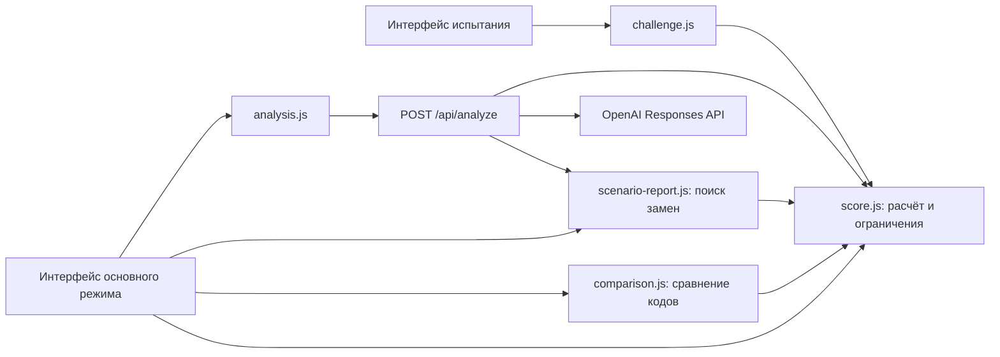

# Аким на 5 часов

**Интерактивный симулятор управления городом · команда Publish or Perish**

Как распределить ограниченный бюджет между транспортом, экологией, социальной сферой, безопасностью и городскими сервисами? «Аким на 5 часов» позволяет собрать набор городских мероприятий, увидеть последствия для пяти районов Астаны и понять, за счёт чего меняется итоговый балл.

Проект предназначен для участников и жюри хакатона, а также для пользователей, которые хотят исследовать компромиссы городского управления в игровой модели. Он делает правила, ограничения и результаты выбора наглядными. Это симулятор на синтетических данных, а не система принятия реальных муниципальных решений.

## Содержание

- [Что реализовано](#что-реализовано)
- [Как работает решение](#как-работает-решение)
- [Технологии](#технологии)
- [Архитектура](#архитектура)
- [Установка и запуск](#установка-и-запуск)
- [Как проверить решение](#как-проверить-решение)
- [Данные и интеграции](#данные-и-интеграции)
- [Ограничения](#ограничения)
- [Развёрнутая версия](#развёрнутая-версия)

## Что реализовано

### Основной режим: пять решений

- Каталог из **14 мероприятий** для пяти районов: Есиль, Алматы, Сарыарка, Байконур и Нура.
- Выбор ровно **пяти мер** при бюджете **100 единиц**, не более двух мер одного направления.
- Предпросмотр результата добавления, отмена выбора с пересчётом и прогноз балла после удаления.
- Проверка несовместимостей, повторов, бюджета и допустимости района. Недоступные карты блокируются; после отмены доступность пересчитывается.
- Подсказки о потенциальных и действующих синергиях.
- Итоги в виде карусели с кнопками, точками навигации и свайпами.
- Вкладка **«Показатели»**: значения до и после, пять направлений и общий обзор для каждого района и города с учётом населения.
- Вкладка **«Сравнение»**: один или несколько введённых вручную кодов, до десяти. Баллы, бюджет, критические показатели и различия по районам рассчитываются без ИИ.
- Разбор выбора на русском языке через OpenAI и рекомендации по допустимым одиночным заменам.
- Вкладка **«Презентация»**: четыре слайда с иллюстрациями и диаграммами. Скачивание автономного HTML-файла с возможностью печати в PDF.

### Режим испытания: восемь кварталов

- Стартовый бюджет **40 единиц**, пополнение на **15** при переходах в кварталы 2–8.
- Базовая рука из пяти карт и два разных события между кварталами: изменения бюджета, цен или размера руки.
- Прогноз учитывает квартал покупки и задержку эффекта. Покупки окончательны; можно завершить квартал без покупки.
- Код турнира задаёт воспроизводимые события и приоритеты колоды. При разных решениях доступные карты могут отличаться.
- Текущие показатели, прогноз на финал и итоговый экран.

Правила испытания и контракт модуля описаны в [CHALLENGE.md](./CHALLENGE.md). Ограничения основного режима на пять решений и две меры направления в испытании не применяются.

## Как работает решение

1. Пользователь выбирает направление, мероприятие и район. Городские меры действуют сразу во всех районах.
2. Модуль расчёта проверяет ограничения и показывает прогноз. Пользователь добавляет меру или пересматривает выбор.
3. После подтверждения пяти допустимых решений сайт показывает итоговый балл, изменения показателей и код сценария.
4. Код можно передать другому участнику или вставить чужие коды во вкладку сравнения.
5. Сервер повторно проверяет коды и рассчитывает результаты. При настроенном ключе он передаёт в OpenAI рассчитанные показатели, формулы и варианты замен для текстового объяснения.
6. Пользователь изучает рекомендации и сохраняет презентацию своего сценария.

### Как считается балл

В основном режиме горизонт составляет восемь кварталов:

```text
Эффект меры = полный эффект × (8 − лаг) / 8
Балл района = сумма(показатель × вес)
Средний балл = сумма(балл района × доля населения)
Score = 0,7 × средний балл + 0,3 × минимальный балл района − N
```

`N` — число показателей ниже 40, подсчитанное по всем районам. После применения эффектов и синергий показатели ограничиваются диапазоном 0–100. Неизрасходованный бюджет не даёт бонуса. Веса, исходные данные и правила находятся в [score.js](./score.js).

Рекомендации перебирают допустимые замены одной из пяти мер, включая перенос в другой район, и пересчитывают весь набор. Показываются до трёх улучшений. Каждое относится к исходному сценарию: их приросты нельзя складывать. Итоговый балл определяет код, а ИИ объясняет рассчитанные результаты.

## Технологии

| Часть | Используется |
| --- | --- |
| Интерфейс | HTML, CSS, обычный JavaScript, ES-модули, DOM API |
| Визуализация | SVG-карта, CSS-диаграммы, локальные PNG-иллюстрации |
| Расчёт и состояние | Собственные JavaScript-модули без внешних библиотек |
| Сервер | Deno, стандартные `Request`, `Response` и `fetch` |
| ИИ | OpenAI Responses API; модель по умолчанию `gpt-4.1-mini`, настраивается через `OPENAI_MODEL` |
| Развёртывание | Deno или Docker; в Dockerfile закреплён образ `denoland/deno:2.9.7` |
| Проверки | Браузерные проверки, скрипты Deno; тест испытания использует совместимый модуль `node:assert/strict` |

React, Vue, сборщик и установка npm-зависимостей не требуются. Приложение запускается без Node.js. База данных в текущей версии не используется.

## Архитектура



| Компоненты | Назначение |
| --- | --- |
| `index.html`, `assets/game.js`, `assets/results.js` | Выбор мер, вкладки результатов, графики и презентация |
| `score.js` | Данные, формулы, ограничения, синергии, состояние выбора и коды `A1` |
| `comparison.js`, `scenario-report.js` | Сравнение наборов и расчёт рекомендаций |
| `analysis.js`, `analysis-api.js` | Клиент API и серверный запрос к OpenAI |
| `serve-local.js`, `start-local.ps1` | Локальная раздача разрешённых файлов и API |
| `serve-hosted.js`, `Dockerfile` | Запуск на сервере с настройками из окружения |
| `challenge-demo.html`, `challenge.js`, `assets/challenge-ui.js` | Отдельный режим кварталов и событий |
| `scenario-picker.js`, `example.html` | Переиспользуемый компонент выбора и пример подключения |
| `ruiling-city/images/` | Иллюстрации районов и направлений |

Локальный и серверный режимы используют общий обработчик сайта. Браузер обращается к относительному пути `/api/analyze` на том же домене. Ключ OpenAI хранится на сервере и не передаётся браузеру.

## Установка и запуск

### Требования

- Git и доступ к репозиторию.
- Deno 2; Dockerfile проекта использует версию 2.9.7.
- Современный браузер с поддержкой ES-модулей.
- Для текстового анализа ИИ — ключ OpenAI с доступом к выбранной модели и интернет на сервере. Остальные функции основного режима работают без ключа.

### 1. Получите проект

```sh
git clone https://github.com/BAITC-Hacks/hack-24299c5d-publish-or-perish.git
cd hack-24299c5d-publish-or-perish
deno --version
```

Если команда `deno` недоступна, установите Deno и добавьте его в `PATH`. Локальная папка `.tools/` не входит в репозиторий.

### 2. Подготовьте настройки

PowerShell:

```powershell
Copy-Item .env.example .env.local
```

Linux/macOS:

```sh
cp .env.example .env.local
```

При повторном запуске сохраните существующий `.env.local`. Для анализа ИИ заполните файл:

```dotenv
OPENAI_API_KEY=ваш_секретный_ключ
OPENAI_MODEL=gpt-4.1-mini
```

Для демонстрации без ИИ оставьте `OPENAI_API_KEY` пустым. `.env.local` исключён из Git и не раздаётся сервером. Настройки локального режима перечитываются при запросах.

### 3. Запустите сайт

На Windows в PowerShell:

```powershell
.\start-local.ps1
```

Прямой запуск через Deno на любой из указанных систем:

```sh
deno run --no-config --no-lock --no-prompt --allow-read=. --allow-net=127.0.0.1:8765,api.openai.com:443 serve-local.js
```

Откройте [http://127.0.0.1:8765/](http://127.0.0.1:8765/). Режим испытания доступен через переключатель в шапке или по пути `/challenge-demo.html`. Остановить сервер можно сочетанием `Ctrl+C`.

Открытие `index.html` через `file://` не заменяет сервер. Обычная статическая раздача также не реализует API анализа.

### 4. Проверьте настройки API

Откройте [http://127.0.0.1:8765/api/status](http://127.0.0.1:8765/api/status). Поле `configured` показывает наличие настроек, но не подтверждает действительность ключа. Реальный запрос выполняется при подтверждении сценария или обновлении разбора ИИ.

### Запуск на хостинге

```sh
docker build -t akim-city .
docker run --rm -p 8000:8000 -e OPENAI_API_KEY -e OPENAI_MODEL -e PUBLIC_ORIGIN akim-city
```

Перед запуском задайте переменные в окружении сервера или панели хостинга:

| Переменная | Назначение |
| --- | --- |
| `OPENAI_API_KEY` | Серверный секрет OpenAI |
| `OPENAI_MODEL` | Модель; по умолчанию `gpt-4.1-mini` |
| `PUBLIC_ORIGIN` | Обязательный внешний адрес сайта без пути, например `https://city.example.com` |
| `PORT` | Порт приложения, по умолчанию `8000` |

`city.example.com` — пример настройки, а не адрес работающей версии. Направьте HTTPS-прокси на порт приложения и задайте таймаут не менее 75 секунд. Подробности и вариант без Docker — в [DEPLOY.md](./DEPLOY.md).

## Как проверить решение

### Демонстрация для жюри

1. Запустите сайт и откройте основной режим. Исходный балл — **52,56**.
2. Выберите следующие меры и нажимайте «Реализовать инициативу» после каждой:

| Код | Мероприятие | Территория | Стоимость |
| --- | --- | --- | ---: |
| M7 | Школа + детсад | Нура | 24 |
| M8 | Центр семейного здоровья / поликлиника | Нура | 20 |
| M10 | Освещение и камеры | Нура | 12 |
| M12 | Единая цифровая платформа обращений | Весь город | 14 |
| M5 | Перевод частного сектора на чистое топливо | Сарыарка | 25 |

3. Нажмите «Подвести итоги». Ожидаемый результат, закреплённый в `score.checks.js`: **56,54307** до округления (**56,54** на экране), затраты **95**, остаток **5**, критических показателей **0**. Действует синергия M10 + M12 в Нуре.
4. Откройте «Показатели», выберите Нуру и социальную сферу, затем переключитесь на общий обзор города.
5. Во вкладке «Сравнение» вручную вставьте один код и нажмите «Сравнить результаты»:

   ```text
   A1:4.0,9.4,10.4,11.4,12
   ```

   Сайт покажет второй результат и различия без обращения к ИИ. Код вашего демонстрационного набора: `A1:5.2,7.4,8.4,10.4,12`.

6. Откройте «Презентация», пролистайте четыре слайда и скачайте HTML-файл.
7. Дополнительно: в новом наборе выберите M4 в Нуре. M7 для Нуры станет недоступной; после отмены M4 блокировка снимется, если нет других ограничений.
8. Перейдите в «Испытание · 8 кварталов» и завершите первый квартал. Появятся два события и условия следующего хода.

Без ключа ИИ выведет сообщение о ненастроенном сервисе; расчёт, сравнение, рекомендации и презентация останутся доступны.

### Автоматические проверки

При запущенном сервере откройте [checks.html](http://127.0.0.1:8765/checks.html): страница проверяет расчёт, взаимодействие с интерфейсом, сравнение, вкладки и обработку ответов API.

Отдельные проверки из корня проекта:

```sh
deno run --no-config --no-lock --allow-read=. server.checks.js
deno run --no-config --no-lock challenge.test.mjs
```

Первая команда проверяет локальный и серверный обработчики, маршруты обоих режимов, сравнение, рекомендации и защиту файлов с настройками. Вторая проверяет правила испытания, включая воспроизводимость событий и полные партии. Проверки API подменяют ответы OpenAI и не выполняют платных запросов; они не подтверждают работоспособность конкретного ключа или внешнего хостинга.

## Данные и интеграции

- **Исходные данные** находятся в `score.js`: доли населения пяти районов, десять показателей, их веса, стоимость и лаги 14 мер, эффекты и три синергии. В прежней документации проекта источником указан хакатонный PDF «Датасет районов»; сам PDF в текущий состав репозитория не входит. Приложение использует зафиксированные значения из кода.
- **Показатели**: T1/T2 — транспорт, E1/E2 — экология, S1/S2 — социальная сфера, B1/B2 — безопасность, C1/C2 — городские сервисы.
- **События испытания** заданы в `challenge.js` и генерируются по коду турнира, без внешнего источника новостей.
- **OpenAI Responses API**: сервер отправляет запрос на `https://api.openai.com/v1/responses` с рассчитанными сценариями, формулами и рекомендациями. В запросе задано `store: false`; ожидание ответа ограничено 60 секундами. При отсутствии чужих кодов инструкция исключает раздел сравнения.
- **API сайта**: `POST /api/analyze` принимает `{ "code": "A1:…", "otherCodes": [] }`; `GET /api/status` возвращает состояние настройки без ключа.
- **Иллюстрации** загружаются из репозитория. Подключений к муниципальным базам, картографическим сервисам или данным города в реальном времени нет.

## Ограничения

- Данные синтетические, карта районов схематическая. Модель не подтверждает реальную эффективность мероприятий.
- Рекомендации ищут улучшения одиночной заменой и не гарантируют глобально лучший набор.
- Текст ИИ зависит от внешнего сервиса и может содержать ошибки. Проверяемые баллы рассчитываются собственным модулем.
- ИИ, сравнение по кодам `A1` и экспорт презентации подключены к основному режиму. В испытании они пока не реализованы; результаты двух режимов не предназначены для прямого сравнения.
- Нет регистрации, базы результатов, общей таблицы лидеров и сохранения текущей партии между перезагрузками. Код сценария не подтверждает личность участника.
- Презентация скачивается в HTML, не в `.pptx`; PDF создаётся средствами печати браузера.
- Встроенных авторизации и ограничения частоты запросов к платному API нет.
- Для анализа нужен сервер Deno или Docker. Статический хостинг, включая GitHub Pages, сам по себе его не запускает.

## Развёрнутая версия

**Подтверждённая ссылка на публичную deployed-версию в репозитории не указана.**

Для демонстрации используйте локальный запуск. Адрес `http://127.0.0.1:8765/` доступен на компьютере, где запущен сервер, и не является публичной ссылкой.
